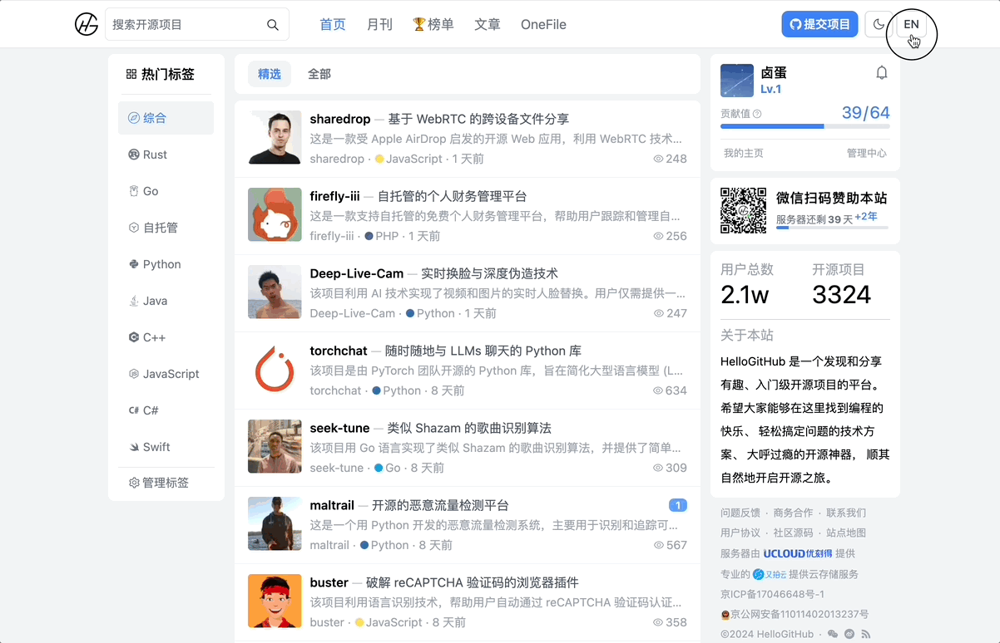

  
   中文 | <a href="README_en.md">English</a>
   HelloGitHub 是一个发现和分享有趣、入门级开源项目的平台 

Geese 译为「惊鸿」可理解为轻盈、快速的形态，希望它清爽、简约的界面可以带给你「惊鸿」一般的访问体验。

## 介绍

Geese 是用 Next.js+Tailwind CSS 构建了一个轻量级的开源社区，也就是「HelloGitHub 社区」的源码。

HelloGitHub 社区提供了不同 **编程语言/类别/标签** 有趣、入门级的开源项目，用户可以这里 **发现/搜索/收藏/评论/分享** 感兴趣的开源项目，还可以 **点赞/提交/打分** 开源项目，让优秀的开源项目脱颖而出。围绕开源项目，社区聚集了一群热爱开源的玩家、技术精湛的大牛、热衷分享的作者，感谢**开源**让我们相识，或许开源精神就是一种交朋友的方式吧！

目前，该社区 **已上线** [在线体验](https://hellogithub.com) 如遇到问题或发现 BUG 可以[一键反馈](https://github.com/HelloGitHub-Team/geese/issues/new)。

## 待认领

- [ ] [【复杂】减小项目打包的体积](https://github.com/HelloGitHub-Team/geese/issues/101)
- [ ] [【简单】待解决的问题](https://github.com/HelloGitHub-Team/geese/issues/38)

开发须知[在这里](./docs/content.md)，感谢每一位参与贡献的[小伙伴](https://github.com/HelloGitHub-Team/geese/graphs/contributors)，十分开心可以和各位一起做开源项目，这段经历让我受益匪浅。

**要求**

1. 拥有 **热爱开源**、**有始有终**、**靠谱** 的性格。
2. 完成时间：可根据自己的实际情况而定，参考：简单（7 天）、中等（14 天）、复杂（30 天）。
3. 有任何问题可在对应需求下的 `issues` 中进行沟通。

## 声明

<a href="mailto:595666367@qq.com">联系我</a>

 本作品采用 <a rel="license" href="https://creativecommons.org/licenses/by-nc-nd/4.0/deed.zh">署名-非商业性使用-禁止演绎 4.0 国际</a> 进行许可。
