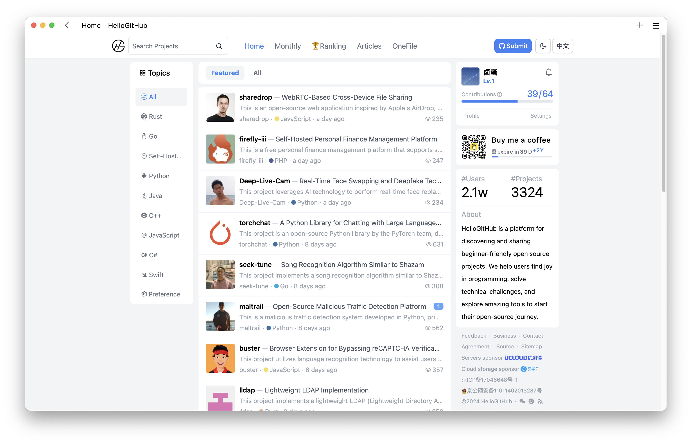

  
   <a href="README.md">中文</a> | English
   HelloGitHub is a platform for discovering and sharing beginner-friendly open source projects 

"Geese" translated as "Jinghong" (meaning a fleeting glimpse), embodies a light and swift form, aiming to provide you with a "Jinghong"-like browsing experience through its refreshing and minimalist interface.

## Introduction

I wanted to create a home for those who enjoy open-source projects, so I built a lightweight open-source community using Next.js and Tailwind CSS. This repository contains the source code for the [HelloGitHub](https://hellogithub.com/) Community.

This community offers interesting and beginner-friendly open-source projects across various **programming languages** and **categories**. Users can **discover/search/bookmark/comment/share** projects of interest here. They can also **like/submit/rate** projects to help outstanding open-source projects stand out. Around these projects, the community has gathered a group of open-source enthusiasts, skilled experts, and authors who love to share. Thanks to **open source**, we have met; perhaps the open-source spirit is a way to make friends!

Currently, the community **is live** for [online experience](https://hellogithub.com). If you encounter any issues or find bugs, you can [report them with one click](https://github.com/HelloGitHub-Team/geese/issues/new).

## Up for Grabs

- [ ] [[Complex] Reduce the package size](https://github.com/HelloGitHub-Team/geese/issues/101)
- [ ] [[Simple] Pending issues to be resolved](https://github.com/HelloGitHub-Team/geese/issues/38)

Development guidelines can be found [here](./docs/content_en.md). Thanks to every [contributor](https://github.com/HelloGitHub-Team/geese/graphs/contributors); I'm thrilled to be working on an open-source project with all of you. This experience has been incredibly rewarding.

**Requirements**

1. You should have a **passion for open source**, **a commitment to seeing things through**, and **reliability**.
2. Completion time: It can be based on your actual situation, with reference times of: Simple (7 days), Medium (14 days), Complex (30 days).
3. If you have any questions, feel free to communicate in the corresponding `issues`.

## Disclaimer

<a href="mailto:595666367@qq.com">Contact me</a>

 This work is licensed under a <a rel="license" href="https://creativecommons.org/licenses/by-nc-nd/4.0/deed.zh">Creative Commons Attribution-NonCommercial-NoDerivatives 4.0 International License</a>.
